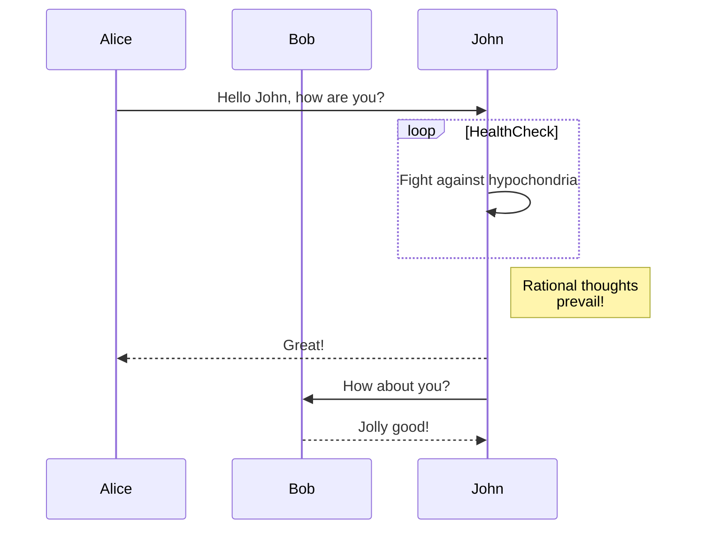
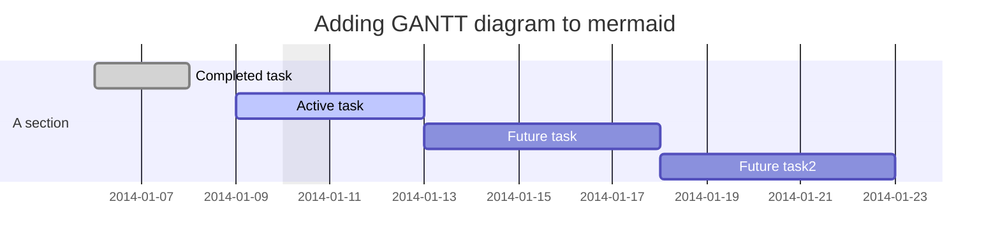

# vulkan-game
Just curious how hard Vulkan is to get up and running compared to OpenGL --- We've got the answer, it's a lot more effort!
Following the [Khronos Vulkan tutorial](https://docs.vulkan.org/tutorial/latest/00_Introduction.html), but using Zig instead of C++ because we're here for a good time.

## TODO
- Reread main.zig and do some tidying
- Maybe update build.zig to do shader compilation within zig build system too
- Continue from [Frames in flight](https://docs.vulkan.org/tutorial/latest/03_Drawing_a_triangle/03_Drawing/03_Frames_in_flight.html)

## NOTES
Reviewed code so far after first triangle drawn to screen.

first a diagram test, might be useful!

